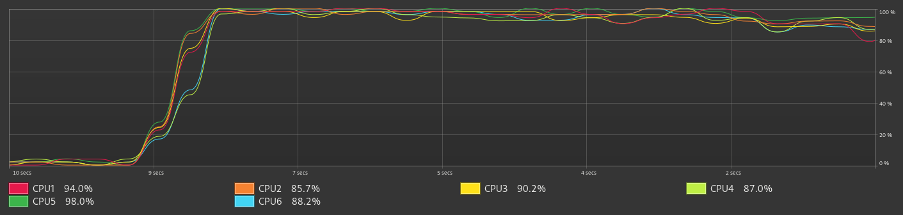
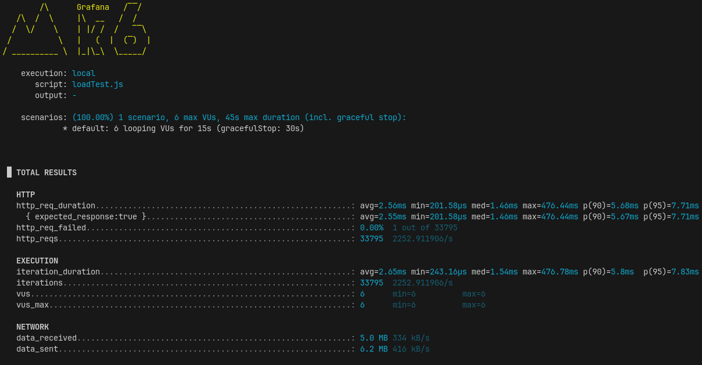

# Transactions demo

This application provides an endpoint, `/api/v1/transactions`, that allows clients to submit transactions for processing.

Submitted transactions are stored in a Redis list and subsequently processed asynchronously by a consumer.

After processing, each transaction is saved to a database


## Asynchronous

The consumer application retrieves items from a list and assigns each item to an available thread for processing




There is a thread that takes items from a list in Redis

```java
fetchTaskExecutor.submit(() -> {
  while (running.get()) {
    try {
      log.debug("Waiting for an available Thread");
      threadAvailability.acquire();
      threadsPoolExecutor.submit(this::processNextTask);
    } catch (Exception e) {
        throw new RuntimeException(e);
    }
  }
});
```
Each task is assigned to an available thread and processed by that thread

```java
public void processNextTask() {
  try {
    String taskString = taskDao.popTask();
    if (taskString == null) {
      log.debug("No task found in Redis.");
      return;
    }
    
    log.debug("Task retrieved from Redis: {}", taskString);
      
    Transaction transaction = parseTask(taskString);
    if (transaction != null) {
      transactionsService.processTransaction(transaction);
    }
  } catch (Exception e) {
      throw new RuntimeException(e);
  } finally {
      threadAvailability.release();
  }
}
```

## Run Locally

Generate docker images

```bash
  ./build.sh
```

Start the app

```bash
  ./run.sh
```

## Run load tests

This will create 6 virtual users who will make thousands of requests during 15 seconds

```bash
  ./k6_load_test.sh
```



> Results for: Intel i5-8500 (6) @ 4.100GHz - 16GB

## 🛠️ API Reference

#### Submit a transactions

```http
  POST /api/v1/transactions
```

| body        | Type     | Description                                  |
| :---------- | :------- | :------------------------------------------- |
| `userId`    | `string` | **Required**. String containing an userId    |
| `invoiceId` | `string` | **Required**. String containing an invoiceId |
